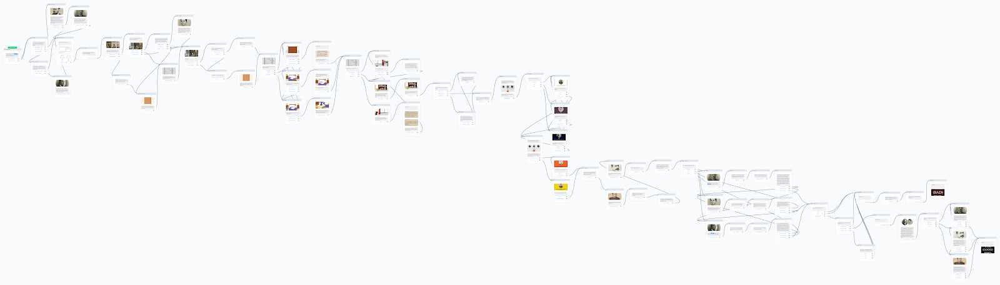

# MurriBot

A project of Social Media Technologies. The aim of the project is to build a theoretical framework and a prototype implementation of a chatbot called MurriBot, based on gamification and storytelling, that is able to offer an alternative way for dissemnating knowledge about one of the most interesting and disconcerting crime cases ever happened in Italy: the **case of Murri**.

## Table of Contents

* [Introduction](#introduction)
	* [Gamification](#gamification)
	* [Storytelling](#storytelling)
	* [Chatbots](#chatbots)
* [Narrative](#narrative)
	* [The Case of Murri: an historical introduction](#the-case-of-murri-an-historical-introduction)
	* [Possible culprit and motivation](#possible-culprit-and-motivation)
	* [The process](#the-process)
	* [The Case of Murri: its historical relevance](#the-case-of-murri-its-historical-relevance)
* [Implementation](#implementation)
	* [Chatbot Design Framework](#chatbot-design-framework)
	* [The Chain of Clues, or: How to Solve the Mystery](#the-chain-of-clues-or-how-to-solve-the-mystery)
	* [Conclusion](#conclusion)
* [References](#references)

# Introduction

The aim of the project is to build a theoretical framework and 
a prototype implementation of a chatbot called **MurriBot**, based on gamification and storytelling, that is able to offer an alternative way for dissemnating knowledge about one of the most interesting and disconcerting crime cases ever happened in Italy: the **case of Murri**.

Three fundamental components need to be woven into the theoretical framework in order to provide a sound basis for the design of the software and the overall experience:

* Some principles of [Gamification](#gamification) and Player Centered Design;
* [Storytelling](#storytelling) elements applied to **crime fiction**;
* [Chatbots](#chatbots) technology and design.

## Gamification

Gamification is the application of game design principles and mechanics to non-game environments.[1] In the last decade its usage has increased exponentially due to three fundamental reasons: 
* the changing nature of information work;
* the entry of digital natives into the workforce;
* the widespread adoption of social media, mobile technology and messaging platforms.

By taking advantage of the interactivity granted by modern technology, gamification represents an efficient and effective tool to convey various kinds of messages and to induce users to take an active role in reaching a specific objective. The active user - or better, the _player_ - lies at the heart of this approach. The other fundamental components that make up gamification are _mechanics_ (what the game does) and _dynamics_ (what the player does in response). For this project the main mechanic is **Narrative**, similarly to what has been done with early Adventure Games. 

Typical objectives achieved through gamification are: improvement of customer management, stronger brand fidelity and improvement of overall performances from employees and partners alike. However, gmaification could be used also for more education-oriented objectives. Presenting a challenge in the form of a well-designed gaming experience based around creative problem solving could make learning, for example, a stimulating mystery to solve.

## Storytelling

Crime fiction is one of the most well-received genres of fiction. It deals with narrative primitives such as the notions of _cause-and-effect_, _agency_, _identity_, _motivation_ and _search of truth_. It does so by treating the whole narrative principle (start → call → task → want → need → goal), which would normally characterise any story at a deeper level, as a _surface structure_ in which each plot event must be justified and the search of truth often takes the place of character development.

In crime fiction, the storytelling elements are traditionally organized as follows:
* the _crime_ represents the inciting incident that sets the chain of events into motion;
* the _call to investigate_ about the crime pulls the investigator into the chain of events in a pro-active role;
* the _task to investigate_ is the mission of the investigator;
* the _resolution of the crime_ is what the investigator wants the most;
* the act of _looking for a chain of clues and following it_ is the need perceived by the investigator;
* the _discovery of "whodunnit" and "whytheydunnit"_ is the goal of the investigator, the final piece of the puzzle that allows them to satisfy their want.

The final goal is, in other words, the search of truth. Who committed the crime? A crime fiction story revolves explicitly about solving this problem: finding the truth of who or what is behind the mystery. Because the whole point of any story – as with any art – is truth-seeking, when it is so direct as in crime fiction, the story is easier to consume, less demanding than stories that are not so obviously and directly about truth-seeking.[2]

## Chatbots

Humans are conversational beings, and as such they naturally tend to feel confortable interacting with interfaces in which the main form of interaction is conversation, understood as a "repeating pattern of reply and response".[3] It is no coincidence that the adoption of social media, mobile technology and messaging platforms has become so widespread. In particular, messaging environments have become the dominant environment in which humans spend their time.[4]

Starting from these considerations, the technology that immediately comes to mind and that is closely related to social media and messaging platforms is **chatbots**. Chatbots are software applications that use artificial intelligence & natural language processing to understand what a human wants, and guides them to their desired outcome with as little work for the end user as possible.[5] These services could be any number of things, ranging from functional to fun, ant they could live in any major chat platform such as Messenger or Telegram. In fact, a defining characteristic of an effective chatbot is that it should not require the user to learn anything while conversing with it: it needs to be able to guide them through choices in a natural way.

Chatbots are usually deployed in companies to engage with their customers and support them in commercial transactions, bookings,form submissions, etc. However, the possibilities are (almost) limitless, and their application can go well beyond customer support.

From a culturally-driven and historically-aware perspective, chatbots could be an excellent engaging tool by gamifying the cultural experience.[6] A gamified chatbot allows to implement narrative into the design of the experience and give it a more supportive and immersive feel. An exemplary case study is represented by the chatbot developed by Invisible Studio and employed by the House Museums of Milan.[7]

# Narrative [8]

## The Case of Murri: an historical introduction

In the morning of September 2nd 1902, a strong and disgusting smell was emanating from **Palazzo Bisteghi**, a palace in the center of Bologna and home of **Francesco Bonmartini**, a Count who came from Veneto to Bologna to live with his wife, **Linda Murri**. That terrible smell aroused the suspicion of the porter of the palace, **Teresa Cicognani**, who at a certain point decided to ring Bonmartini’s bell. No answer came in. She sensed that something bad had happened. The porter decided to call one of the members of the Murri’s family, since the Count had no relatives in the city. The first to come was **Tullio Murri**, Bonmartini’s brother-in-law. Linda was in Venice with her children in that moment. Tullio, once he arrived at the palace, immediately took control of the situation and without esitation he called the police, ordering them to force the lock of the door and to penetrate into Bonmartini’s flat.

Tullio, Riccardo (Tullio and Linda’s uncle) and the policemen froze, utterly shocked by what they saw.

Bonmartini was lying dead, onto a corner of the antechamber of his room, mangled by thirteen cruel stabs. The fiercest wound was the one that pierced his breastbone from side to side. The deepest was at the level of the hyoid bone and of the larynx. There was a continuous linear solution with sharp margins, 22 millimeters long, in the crosswise direction, from the bottom to the top. The cuts were very precise and were inflicted according to a logical order: the first to his heart, then the neck, to prevent him from crying out. This fact suggested an expert hand, capable of committing a truculent act of violence in a clean, precise way. The corpse did not show lacerations nor folds, but only crisp cuts and a very advanced state of decomposition.

Bonmartini passed away during his 33rd birthday. Before his death, he travelled on his own from Venice to Bologna. He was alone also in the day in which his body was carried to Carzavere, his native town, to be buried in the family tomb. Only a crown of flowers, given by the Murri Family as a testimony of their grief, kept his corpse company.

In the afternoon on September 2nd, the police began the investigation. They were facing a tough case, certainly, but there was one sure thing about it: a member of the victim's family was the culprit. In fact, there was no trace of break-in on the doors and locks of the palace: everything was almost perfectly clean, tidy and in order. The killer had to have the keys of the flat.

They began to investigate among the Murri’s Family. Every one of them had a reason to kill...

## Possible culprit and motivation

### Augusto Murri (the father-in-law)
The head of the household, Augusto Murri, was well-known by his fellow citizens. He was an illustrious and upstanding man and the father of a respectable family, a scientist, clinician and professor at the University of Bologna. He was considered one of the most eminent exponents of a secular morality and culture that was being scratched off by an unstoppable breakdown that he was ready to fight against in the name of the values he believed in. This scientific and progressive culture trusted in reason as being an instrument of moral and intellectual evolution of mankind. During his whole life, he carried forward the ideals of Positivism and Democracy, the predominant cultures in Italy at the sunset of the XIX century. 

Despite this unshakeable faith in reason, he could have lost it in a fit of rage and killed Bonmartini. In fact, he had had a friction with the Count a little bit before his death. He did not tolerate the fact that the relationship between his daughter Linda and his husband had long since cracked, and this is why he did not accept Bonmartini as assistant in his practice. This fact provoked a deep frustration in the Count. Bonmartini was an exponent of the nobility and its values (the faith in Catholic creed, for example), but he was very attracted by the world of gentry, their strength and modernity. This is why his great desire was to become an assistant of Augusto Murri, one of the most important luminaries within the medical field in that moment of history. But his dream fell into pieces.

### Linda Murri (the wife) and Carlo Secchi (her lover)
Bonmartini’s wife, Linda Murri, could be a possible culprit as well. She was an enigmatic woman, considered a “modest little woman of the house”with a strong maternal sensitivity, a strong emotional control and a magnetic glance that made her stand out. When she was young, she was in love with Carlo Secchi, one of Augusto’s pupils, but her family banned her from marrying him because of his age: he was twenty years older. After the marriage with Bonmartini, she kept on meeting Secchi in a flat rent for their love conventions. Their meeting did not seem to come to an end.

### Tisa Borghi (Carlo Secchi's nurse and assistant)
When Bonmartini passed away, Secchi had been able to establish himself as one of the best otolaryngologist in the city. At Istituto Rizzoli he had known a nurse, called Tisa Borghi, and decided to hire her as assistant and servant, after being her lover. Tisa Borghi was a very cold and secretive woman, jealous of her own secrets. However, she was not reluctant to declare her hatred towards Linda. Maybe this hatred was so strong to push her to commit a murder.

### Tullio Murri (Linda Murri's brother)
Another possible culprit could be Linda’s brother, Tullio Murri. Tullio had a curious and uncommon personality: he was a man in love with pleasure and lust, devoted to spending his life between women, cards and politics. Similar to the main character of “L’innocente” by D’annunzio, who has the same name, his nature was impetuous. With respect to Bonmartini, Tullio did not judge him as a good husband for his sister: he considered the Count psychologically insensitive and the fact that Bonmartini had a lover further aggravated the situation. The instability of Tullio’s personality became more and more evident, and for him to commit a murder was definitely not impossible.

## The process
The process was long and complicated. One by one, the members of the Murri Family were accused to be guilty and every one of them provided a different version of the fact. But when the investigations seemed to be in a dead end, Tullio, accused even by his father Augusto Murri, confessed. Tullio wanted to do away with Bonmartini. As the D’Annunzio character, he supported the dignity of a homicide conceived as a Prometheus virtue. Therefore, the man who committed a crime was the son of Augusto Murri, that professor who was envied for his brilliant mind and fought so strongly to modernize and secularize the culture and its institutions. As the Catholic journal “L’Avvenire” wrote, the evil came exactly in the home of who claimed to regenerate the population through rational and scientific education.

## The Case of Murri: its historical relevance
The case of the Bonmartini’s murder was very relevant from different points of view. The first thing to say is that it can be considered **the first Italian media event ever**.

It was a crime made of love, passion and treason. Its setting was the charming middle-class world, with its vices and its few values. All these kinds of elements captivated most of the population. People talked about this crime in coffee bars, all around the streets of the city of Bologna, and in the salons, as an occasion of recreation and amusement. What really intrigued and attracted people was being able to penetrate into a family of a very brilliant and envied social class, the Middle-Class, reading everything about the investigations on the journals that went around the city.

The case was followed, analyzed, discussed and commented in such a way that it crossed the national borders and arrived also in France and in England, where the murder was strongly envied for its power of attraction. However, the Italian population was rigidly criticized, because it was considered to be the most inclined to believe in evil in a strictly religious sense and characterized by an inadequate sense of justice.				
The news about Murri’s Family spread and investigations became a fixed appointment for all the readers of every journal of any political party, who were so impatient to come to know all the hidden sides of all their unsuspecting citizens’ lives. In this way, one by one, the members of the family became the protagonists of a new love affair, of an obscene incest or another absurd scandal. An actual editorial competition had raised up: journals got richer and richer of gossips and full of photos of the characters, the settings of the murder, and even satirical illustrations.
				
Newspapers played a central role even in the investigations themselves, preceding the policemen in discovering new important details to solve the case. The press became so outrageous that it attracted the attention of the Vatican, which scolded the editorial staffs for their invasiveness, ordered them to avoid the details of the case and gave them new guidelines on how to deal with that crime news. They had to consider the fact by a more general point of view, which would be more useful and educational.

However, that captivating family intrigue was not only an occasion for spending time on rumors, but it also had a very higher potential. That judicial case was an opportunity to raise awareness of the disruptive and disorienting function of the press. Moreover, it was particularly suitable for becoming an optimal vehicle of ideological messages and political influences toward a vast, socially and culturally diversified public. In fact, that murder immediately appeared as a moral and ideological prompter, a mean of political propaganda and an instrument of modelling, developing and orienting the public opinion, whose role and function were being studied during those years.

From an ideological point of view, this case represented a struggle between Rationalism and Catholicism. The journals that supported the Catholic party violently attacked science and its attempt to regenerate mankind by means of a new rational and laic education. In catholics' opinion, it was not a coincidence that an evil homicide like that happened in a family whose head household, Augusto Murri, was a man of science. He believed in the guidance of reason and carried on a secular morality, claiming that scientific truth corresponded to moral truth, but he himself witnessed the fallacy of his theories in his family environment. So, from this point of view, the murder of Bologna demonstrated that the laic and positive education, considered a mean for containing and controlling the physical and moral degeneration of the nation by the scientists and positive intellectuals, produced everything, but immorality and criminality. This is why the Catholic press wanted to take on the role of defender of justice. Their presence in social life and institutions was necessary. The attack also hit Socialism, another one of the ideologies which characterized the second-half of the XIX century. Catholics showed to the working class that their political supervisors, who were atheist and materialistic, did not defend their economic interests and their dignity as a class, but they supported the corrupted and parasitic Middle-Class. So, they oriented the public opinion toward a very strong contempt and hatred addressed to the bourgeoisie, considered too elitist. The fact that the killer, Tullio, was a socialist leader, his father one of the most important exponents of Positivism and the victim a believer man, made the Catholic thesis more incisive.

The Bonmartini’s murder went down in history also for another reason. It was an intense and vivid example of the popular literature of the first half of ‘900. It was called “Romanzo di Bologna”. It had all the features of a popular novel of that time: a political background, some multi-colored characters, flooded personalities, regional tempers, political memberships, interpersonal relationships. Most of the plot was written by the newspaper and attracted so many people to consider this crime the first media case in the Italian history. The birth a new type of language was related to the interest of journals in this crime: the language used for the crime news became completely different from the one used for any other article. It was independent from the ideological choice and particularly raw, cruel and realistic. Moreover, people attended a very great but silent revolution linked to this fact: all the funny and captivating episodes of the “Romanzo di Bologna”, published on the journals of any political party every day, allowed the population to access to reading and, as a consequence, to the rise of literacy rate. 

Therefore, the event involved the public opinion so much that it became the most famous and discussed judicial case of Giolitti’s age. This happened because it was treated as an object of ideological and political abuse that turned into a very evident fact, especially in the newspapers articles. The Murri case accused many of the values that have been the backbone of the process of nation’s growth and development. Positivism, Socialism and Rationalism were coming to an end and, by the time, the XIX century breakdown was inexorable.

# Implementation

## Chatbot Design Framework

### Chatbot Scope
Bots are created with a purpose. It is really important to make clear what people can expect from our chatbot. The best way to set the scope is making it clear in the _welcome message_: the bot should introduce itself, explain what it can do and suggest a first task. It should also provide _continuous support_ through commands like "help", etc... The bot should drive the conversation forward and even restrict it, if necessary, through short interactions, as well as always respond, even when it does not understand the user's input. A focused bot that does a few things right is more useful than ones that barely breaches the surface.

The scope of the implemented chatbot is edutainment. In particular the user-target corresponds to younger audiences using Facebook and Messenger. We wanted to create a technological medium that could entertain the users who use it, but, at the same time, let them learning something new, relevant from the historical, sociological, linguistic and literary points of view.

### Chatbot Target
The chatbot game is directed mainly to young users to engage them in exploring the history of one of the most important murder cases ever happened in Italy. This engagement can provide a smarter way of leading younger audiences to interact with objects and historic environments with greater attention.

### Chatbot Personality
The personality of the chatbot is one of the most important points to take into account. The content can stay minimal, but the medium does not have to. There is a clear distinction between the content and the delivery; the what and how. When users chat with the bot, they expect clear answers. However, you can use the opportunity to add a bit of flavor to the message. It has to fit perfectly with the user and with the specific situation. Defining in advance how the chatbot is going to be will be helpful eventually to decide how the bot will talk and act in every situation.

The chatbot we designed and implemented has a human personality. He is a noir detective, called Detective Righi, and he is able to have a conversation with a real human being (the player) characterized by a very realistic and familiar linguistic style. In fact, the user does not to have the perception of talking to a computer, but with a human man who is investigating to discover the culprit of a crime. 

### Chatbot Features
These represent information any user would need from the chatbot to find it usable and fun. Messaging apps let us remove most interface elements and reduce the experience to a simple message thread. Chatbots live within messaging apps and users are already accustomed to communicating with friends using text, but images and structured content are also an excellent way to present information in a more interesting way.

### Chatbot Flow
This is a model of the chatbot behavior in every possible scenario during its interaction with the user. It must highlight:

1) the ways the user is taken to the chatbot functionalities; 

2) a welcome message that functions as an introduction to the conversation;

3) every possible scenario the bot will need to deal with.

Interaction should be simple. The number of paths a conversation can take increases the potential for dead ends. It is better to limit the functionality and nudge the user down a particular path: a simple solution is to use structured messages to guide the users.

## The Chain of Clues, or: How to Solve the Mystery
The goal of the players is to find out who killed the Count Bonmartini. They can discover it interacting with the chatbot, which is a detective, called Detective Righi, acting on the crime scene.

The player will be able to try to determine who was the culprit of Bonmartini’s death, starting from some clues suggested by the bot. They will obtain these clues by questioning the bot about the characters involved in the murder, the crime scene, the objects present in there, the characteristics and peculiarities of the corpse. By having a dialogue made of questions and answers with the bot, users will be completely captivated in the atmosphere of a real crime, playing the role of a true detective in the real setting in which Bonmartini was killed.

At first, the chatbot setups a dialogue with the player, in a way that users will be completely captivated in the atmosphere of a real crime, playing the role of a true detective in the real setting and time in which the Count Bonmartini was killed:

* Setting: During the game, the player will gather evidence in the place in which the Count was found dead. In particular, she will be led by the detective to the building where Bonmartini lived. She will get into his flat, searching for clues in the antechamber of his room and in his room itself.

* Time: The dialogue starts with a greeting by the chatbot to the player. It says: “Good afternoon”. It is very important, since it shows that the time in which the communication is set corresponds to the real day on which the corpse was found. In particular, we are on 2nd September 1902 and it is afternoon. Now the investigations are about to begin.

During the whole dialogue with the chatbot, the player will be able to gather evidence:

* About the corpse: At first, the user will be provided with the autopsy document (represented by means of two images). It is made of two parts: the first sheet shows a brief anatomic summary, through which the player will know that the Count was stabbed thirteen times; the second sheet corresponds to the sketch of the body, characterized by thirteen stab wounds all along it. There is also the doctor’s opinion: “Autopsy findings are characteristic of a murder”. Then, he will be able to see the dead body (represented by means of an image) onto a corner of the antechamber of his room.

* About the crime scene: A map representing the floor plan of Bonmartini’s room is provided to the user. In several steps, the user will be able to interact with every object present there, looking for clues support her hypothesis and make her formulate a thesis. In particular, the player will discover clues interacting with:

	* The entrance door: The entrance door lock appears unforced. The culprit cannot be a thief. The killer has to be one member of the family or a Bonmartini’s friend, since he does have the keys to get into without forcing the door lock.
	
	* Drawers: They look in order, every object in its place. Opening one of them, the user will discover a letter, whose recipient is the Count. Probably Bonmartini had a secret lover, but she cannot be the culprit, since the solution of the mystery would be too easy.
	
	* Bed: The bed is the only one thing in the room that appears to be untidy. It is unmade, like something's been going on. If the user checks it, she will discover a pair of woman’s panties among the sheets. Probably Bonmartini had a secret lover, but she cannot be the culprit, since the solution of the mystery would be too easy.
	
	* Champagne bottle and glasses: They are on a table next to the bed. The bottle is half-empty and the glasses dirty. Probably Bonmartini had a secret lover, but she cannot be the culprit, since the solution of the mystery would be too easy.
	
	* Chamber pot: The user will find out an hair next to the chamber pot. The hair is of a woman. Probably Bonmartini had a secret lover, but she cannot be the culprit, since the solution of the mystery would be too easy.
	
	* Chest: Opening it, the user will find two notes by Linda to “Nino”, Tullio’s nickname given by his sister. These two notes will be important later: Tullio and Linda are speaking about a poison.
	
	* Bin: The bin is full, so someone used it and nobody cleaned it up before Bonmartini’s death. By emptying it, the player will discover a vial of curare poison. At the end of the game, the user would probably understand that the killers had tried to poison Bonmartini to kill him, but, since that dose was not lethal to a man, they had stabbed him instead.

* About the characters: First, a genealogical tree of Murri’s family is displayed. The following characters are present in there:

	* Augusto Murri: the head of the family;
	* Linda Murri: Augusto's daughter;
	* Tullio Murri: Augusto's son and Linda's brother;
	* Francesco Bonmartini: Linda's husband;
	* Carlo Secchi: Augusto's pupil and Linda's lover;
	* Tisa Borghi: Carlo Secchi's nurse and lover.

At this point, the user can make questions about each of these characters. It will be said:

* about Augusto: Well-known clinician and professor at University of Bologna, exponent of the Positive culture. Shortly before Bonmartini’s death, he did not accept him as assistant: “For personal reasons between him and me” he said. In fact, he did not accept that the relationship between Linda and Bonmartini had long since cracked.

* about Linda: Linda was an enigmatic woman: she was considered a “modest little housewife” with a strong maternal sensitivity, but her great emotional control made her stand out. She did not lead an excellent marital life: people said that she had rented a small flat for her love conventions, after coming back to her husband after a brief separation.

* about Tullio: Tullio Murri, a layer, was a pleasure-loving man, who spent his life between women, cards and politics. Similar to d’Annunzio character, his nature was impetuous. He believed that Bonmartini was psychologically insensitive and for this reason his sister was threatened and had to be defended against everything.

* about Bonmartini: The player obtains information about him at the beginning of the game. About him: the Count Francesco Bonmartini was found dead in his house on 2nd September 1902. Before his death, he tried to become an assistant of his father-in-law Augusto, clinician and professor. Augusto refused. Bonmartini declared that he would leave Bologna to move to Padova with his children.

* about Carlo: Prominent otolaryngologist and Augusto’s pupil. Secchi was the man who had been denied to Linda by her family because of his age, 20 years older, before her marriage with Bonmartini. After Bonmartini’s death, he was accused of being Linda’s lover. The accusation was grounded.

* About Tisa: Already a nurse at Istituto Rizzoli, where Carlo Secchi had known her. She became his assistant and servant, after being his lover. She was a cold woman, used to keeping herself locked in her own secrets. But she was not reluctant to declare her hatred towards Linda. Without ever revealing the true reasons of that hatred.

These information are shown to the player by means of some cards, each one of them corresponding to one character. Every card is a different color, which represents the main characteristic of the character’s personality. In addition a symbol is used for the same purpose:

* Augusto Murri > White as his pure creed in Positivism. A syringe as symbol since he is an acute doctor, sometimes scary.

* Linda Murri > Purple as her ambiguity. A rose as symbol for her sensitivity, but at the same time passion for lovers.

* Tullio Murri > Blue as his dark personality. Cards as symbol of his arcane personality.

* Francesco Bonmartini > Red like his blood shed. Knife as symbol of his last day on earth.

* Carlo Secchi > Orange like his energy. Even if he is an old man, he is able to mantain the relationships with two ladies. Stethoscope as symbol of his job. He will be the doctor that will provide the poison to kill the Count.

* Tisa Borghi > Yellow as her jealousy towards Linda. Menacing eye as symbol of her dangerous personality.

After having all the information about the characters, the player can continue the game by interrogating each individual person at once. The interrogatory will proceed as follow, starting necessarily with Tisa and then Carlo:

* Tisa > The user asks her if she knows curare. She says that she knows that it is a poison and reveals that recently she has been asked to bring it to a certain… but she does not finish the sentence and so she does not reveal the name of who wanted the poison.

* Carlo > He explains that the curare was necessary for an experiment on a lamb. He would do that experiment.

* Augusto > Augusto asks why he is asked about curaro. He reminds that Bonmartini was stabbed, not poisoned, also because curaro is lethal on animals like lambs, not on human beings, because of their excessive size. In addition, he reveals that he does not know Tisa Borghi.

* Linda > Linda contradicts herself during the interrogation. First, she claims not to know what the curare is, but then, by mistake, to the question on lamb experiment she says: “I feel outraged [...] I find myself talking about poison and lambs [...].”. This sentence shows that she was really aware of what the curare is. 

* Tullio > When he is asked if Tisa is involved in the poison issue, he says that he never asked her to bring him it. But no one had asked! In addition, he speaks about certain notes in Bonmartini’s chest as attempt to bring his family down. But how does he know the fact of notes, since the crime scene is a closed area?

At this point, the user has to gather all the evidence together and try to say who is the culprit (just one person or more than one).

The killers are Tullio and Linda, who first tried to kill Bonmartini poisoning him, then stabbing him the final death. This because Tullio did not approve of Bonmartini and Linda wanted Carlo Secchi, her lover, as husband. 

 After the accusation, the interactive game is finished. In order to maintain the historical truth, if the player guesses the right killer/killers, we end with what happened to all the characters during the process:
 
* Linda Murri was involved in the plan of the murder and was arrested. She was released after 1 year for a concession of King Vittorio Emanuele III. He wanted to reward Augusto, who had cured the King’s daughter, Mafalda.			

* Tullio Murri was arrested on charges of murder. He was reported by his father Augusto, who read a letter of confession written by his son before giving himself up to the police. He said: “I killed to defend me. This is the pure truth.”				
* Augusto Murri accused his son to be the killer of Francesco Bonmartini after reading the Bonmartini’s letter of confession, but said to have destroyed it. He did not want his wife to find it out. After two years of legal process, he came back to the University of Bologna.	

* Carlo Secchi was arrested on charges of being an accessory to the crime. Tisa Borghi accused him to have provided Tullio Murri with the poison to kill Bonmartini. After a period in prison, he committed suicide.

* Tisa Borghi had the possibility of confessing everything in order not to be imprisoned. She told the police that Carlo Secchi prepared a vial of curare to be used to kill Bonmartini. She avoided the jail. 

If the player accuses the wrong person/people, she has to start the game all over again.

Overall, the narration has a very precise structure. It reflects the order in which the investigations are carried out: the corpse is checked, the crime scene is checked, a list of suspects is drawn up, a certain person is questioned and accused rather than another.

Also the images of the crime scene and the objects present in there contribute to create the atmosphere of a real crime and investigations.

We implemented the chatbot at issue using an online tool called “ManyChat” (https://manychat.com/), which allowed us to setup a dialogue between the bot and the human user. The dialogue has the following structure: the bot tell or ask something to the user (for example, the bot asks the user which object she wants to interact with to discover some clues), and the user can answer selecting one of the options shown by the bot, until the end of the game. The options could be one, two or three. In this way, a graph containing all the possible choices - connected each other - is generated.

In addition, ManyChat allows us to gather some data about the users: their profile image, their name, gender, status (subscribed or not to the chatbot) and subscribed (the last time they accessed the bot). We could use to adapt the features of the bot to the users’ characteristics.

Eventually, the tool also shows some statistical data, useful to check the number of users per day. If the statistical data would show too few users, we could understand that it could be necessary to study strategies to make the bot more attractive.

## Conclusion
Though it is a very simple bot with hardly any cognitive skills, it has been a good way to get into storytelling on social media and to get to know about chatbots by helping us think through the design and challenge of creating a chatbot within a certain theoretical framework.

### Future Developments
* A non-linear structure of the conversation.

* As Matt Hartman said, the difficulty in building a chatbot is less a technical one and more an issue of user experience. The most successful bots will be the ones that users want to come back to regularly and that provide consistent value. Evaluation tests have to be done to assess the strong and weak point of the chatbot and to act on them in an iterative way. Verifying the effectiveness of the user experience is fundamental.

# References
* [1] Huotari, K., & Hamari, J. (2012). "Defining Gamification – A Service Marketing Perspective". Proceedings of the 16th International Academic MindTrek Conference 2012, Tampere, Finland, October 3–5.
* [2] https://beemgee.com/blog/crime-fiction/
* [3] https://deeson.co.uk/blog/why-conversational-interfaces-are-here-stay-and-how-plan-your-chatbot
* [4] https://businessinsider.com/the-messaging-app-report-2015-11?IR=T
* [5] https://www.drift.com/learn/chatbot/
* [6] https://chatbotsmagazine.com/how-museums-are-using-chatbots-5-real-world-examples-34e9d4858dd9
* [7] https://invisiblestudio.it/new/portfolio/chatbot-game/
* [8] Babini, Valeria Paola. Il caso Murri: una storia italiana. Il mulino, 2004.
